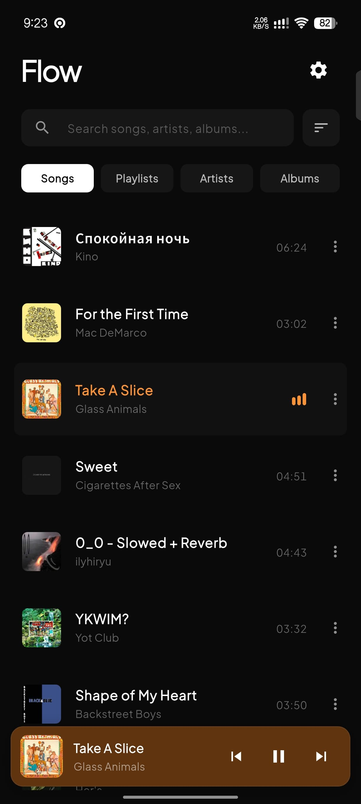
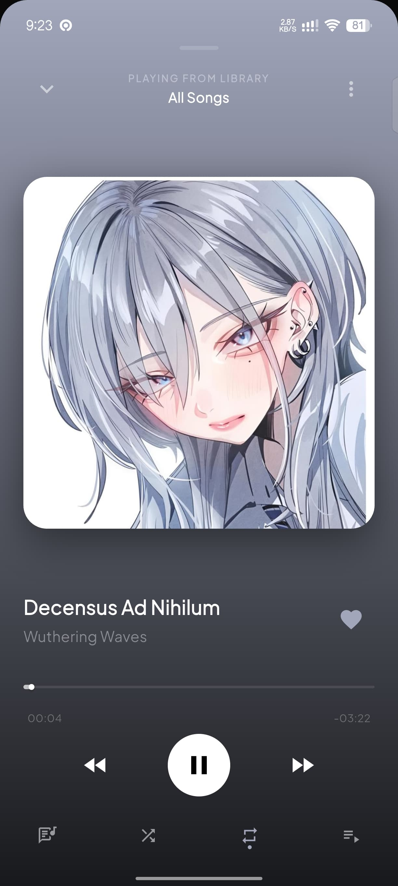
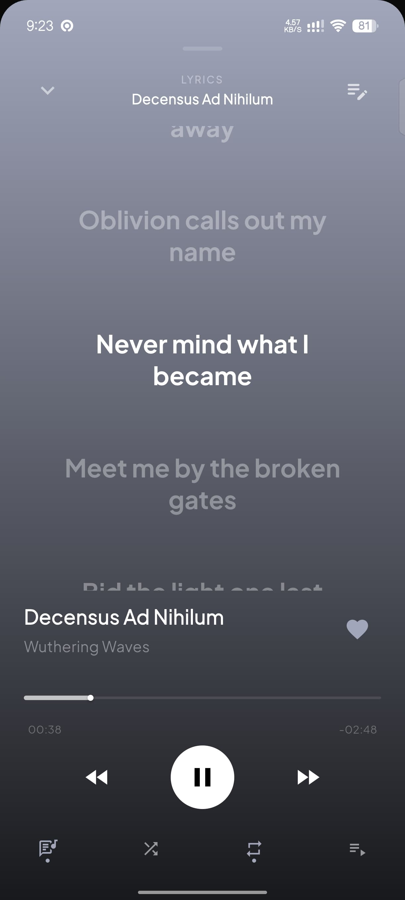
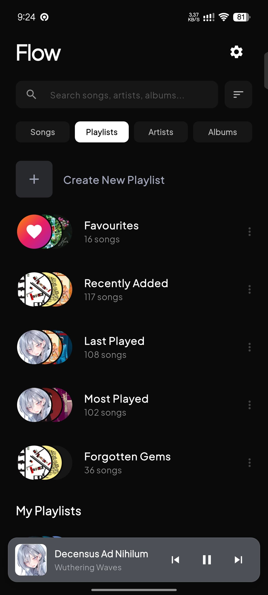
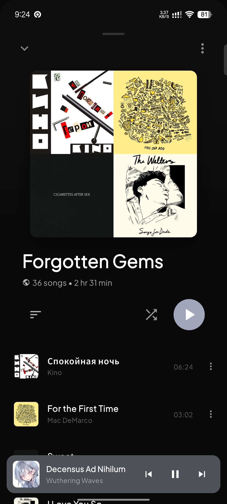
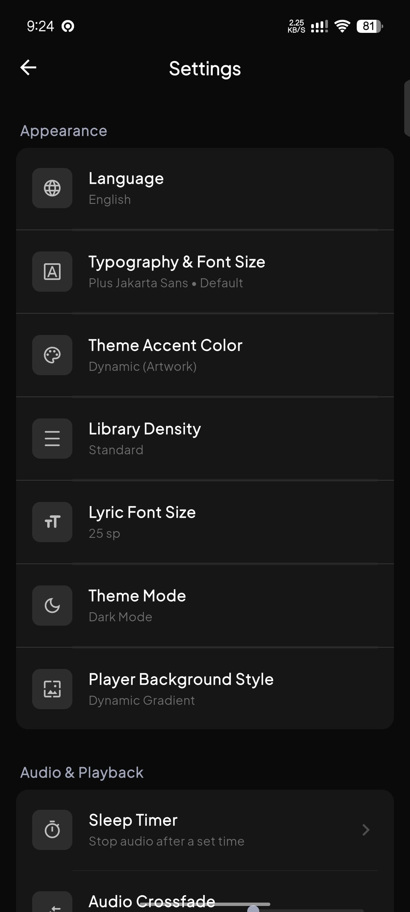

# Flow Audio Player

Flow is a modern, feature-rich local audio player built with Flutter. It focuses on providing a premium listening experience with a clean user interface, seamless background playback, and smart track management.

## Previews

  
  
  

  
  
  

## Features

- **Local Audio Scanning**: Automatically queries and fetches audio files from scoped device storage with reactive permission controls.
- **Smart Playlists Engine**: Dynamically aggregates tracks into _Favourites_, _Recently Added_, _Last Played_, and _Most Played_ lists based on secure play statistics.
- **Custom User Playlists**: Create, rename, and manage custom playlists. Batch add multiple songs using the **Hold-to-Select (Multi-Select)** mode. Personalize playlists by picking custom image covers directly from the device gallery.
- **Background Playback**: OS-level backgrounding service with system notifications, lock screen media controls, and native audio sessions.
- **Adaptive Aesthetics**: Spotify-like dynamic background color extraction from album art using `palette_generator`, painting beautiful rich linear gradients.
- **Custom Player Background Styles & Real-Time Wallpaper Editor**: Support for four breathtaking Now Playing rendering modes: **Dynamic Gradient** (color extracted linear blend), **Apple Blurred Cover** (clean, high-fidelity glassmorphic overlay powered by an optimized hardware-accelerated `ImageFiltered` widget wrapped inside a precise `ClipRect` to prevent bleeding), **AMOLED Deep Black** (pure solid black for visual minimalism and battery saving), and **Custom Gallery Image**. Features a **real-time wallpaper editor** under Settings to adjust **Blur Level (0-60)** and **Dim Level (0-90%)** with an interactive 9:16 miniature live mockup preview.
- **Global 3-Choice Theme Modes**: Rich selection between:
  - **Dark Mode**: Sleek, battery-saving dark theme (`#0A0A0A` scaffold, `#161616` cards).
  - **Light Mode**: Gorgeous, clean light theme (`#F6F8FA` scaffold, `#FFFFFF` cards).
  - **Custom Theme Mode**: High-fidelity theme customizer supporting a glowing **Dynamic (Artwork)** background, **5 Luxury Solid Color Backdrops**, or **Custom Gallery Image Wallpaper**. Features a **real-time theme wallpaper editor** inside the Settings panel to customize blur and dim levels with an interactive live miniature replica of the Library Home Screen.
- **Dynamic Theme Accent Customization**: High-fidelity custom accent preset selector with 9 premium solid presets (Spotify Green, Apple Red, Deep Purple, Tidal Cyan, Sunset Orange, Sakura Pink, Luxury Gold, Sapphire Blue, Electric Lime) or **Dynamic (Artwork)** color matching.
- **HSL Contrast Safety (Auto-Brightener)**: Real-time mathematical luminance safety interceptor that automatically boosts dark extracted cover art colors into readable pastels/neons, mapping pure black/desaturated covers to a sleek, premium Silver-Grey.
- **ValueNotifier Real-Time State Sync**: Continuous visual color stream coupling that propagates theme modifications and cover artwork changes instantly across all pushed settings panels, switches, and sliders in real-time.
- **Interactive Lyrics Engine**: Synced LRC & plain text support with zero truncation. Renders dynamic word-wrapping karaoke streams styled perfectly to Flow's custom fonts without cutting off text. Features jitter-free layout rendering and global typography inheritance for flawless text animations.
- **Built-in Image Cropper**: Fully integrated, pure Flutter 1:1 and 9:16 aspect ratio image cropping engines with a sleek custom UI for effortlessly editing custom album covers and portrait player backgrounds.
- **Multi-Select Batch Actions**: Intuitive "Hold to Select" mode across all song lists for rapid queueing or mass additions to playlists, powered by a dynamic theme-adaptive action bar.
- **Dynamic Sleep Timer**: Automatically stop audio playback with built-in presets (15m, 30m, 60m) or custom inputs, complete with a live counting indicator on the player header.
- **Precision Audio Transitions**: Custom Crossfade adjustments (0ms to 3000ms) with a 150ms fade-in/fade-out playing transition to avoid pops/crackles.
- **Auto Regex Cleaner**: An aggressive, native RegExp title cleaner that removes underscores, empty brackets, and cluttered suffixes (like `4K Remastered`, `Official Video`, `Remastered`).
- **Dynamic Artist Extraction**: Automatically parses song titles to extract and populate missing artist fields when the local file's metadata tags are empty or unrecognized.
- **Virtual Metadata Editor**: Edit song Titles, Artists, and Albums virtually inside the app interface without touching the physical source files.
- **Dynamic Durations & Equalizers**: Formatted track durations are beautifully shown next to song lists, which seamlessly transform into live-animated `MiniMusicVisualizer` equalizers when tracks are actively playing.
- **Pixel-Perfect Margin Alignment**: Custom spatial translations (`Transform.translate`) align song controls and durations at a precise `24px` horizontal screen margin, perfectly lining up with page pills, search headers, and playlist card boundaries.
- **Robust Cache Manager**: Ultra-fast artwork preloading engine with multi-tier retries and anti-null failure mechanisms, guaranteeing that all thumbnails load instantly upon opening the application without race condition blank-outs.

## What's New (v1.0.3)

- **Library Layout Density Selector**: Added a "Library Density" setting (Standard vs Compact) allowing users to customize track row spacing, thumbnail sizing, and padding to fit up to 25% more songs on screen.
- **Auto-Play on Headset Connect**: Implemented an "Auto-play on Headset Connect" toggle under Audio & Playback. Flow listens to native `AudioSession` device change events and automatically resumes playback when headphones or Bluetooth audio devices connect.
- **Playback Speed & Pitch Controls**: Added dedicated Playback Speed (0.5x - 2.0x) and Pitch Lock configuration to Settings and audio engine, giving users full control over tempo and natural audio pitch.
- **Custom Lyric Font Size Configurator**: Added a "Lyric Font Size" setting with live preview slider (14sp to 30sp), dynamically scaling synced and plain text lyrics across player views.
- **Android Mono Audio Integration**: Re-architected native `MainActivity.kt` and `settings_screen.dart` Mono Audio toggle logic. Implemented multi-key fallback (`master_mono` and `mono_audio` across `Settings.System` and `Settings.Global`) and eliminated false-positive "not supported" toast errors and startup state resets.
- **Robust Scoped Storage Deletion Fallback**: Fixed an issue where deleting a track from device failed to present the "Permission Denied / Hide Track" dialog due to an unmounted `BuildContext` after closing the context menu. Captured `parentContext` to guarantee the fallback dialog is reliably displayed on Android 10+ devices.
- **Auto-Check for Updates Toggle & Startup Check**: Added an "Auto-check for updates" toggle switch in Settings. When enabled, Flow automatically performs a background release check on app launch and prompts the user with an update dialog if a new version is available on GitHub.
- **Synced Last Played & Most Played Logic**: Unified track recency and play-count tracking. All played tracks with `playCount > 0` are automatically backfilled and synced into the **Last Played** smart playlist, ensuring Last Played count is always consistent with Most Played.
- **Audio Ringtone Cutter & Editor**: Integrated a dedicated Ringtone Trimmer accessible directly from any track's context menu. Features interactive dual-handle `RangeSlider` duration selection, real-time slice audio preview playback with timestamp display, dynamic segment length badges, and 1-tap ringtone saving to `/Ringtones/`.
- **Sleep Timer Soft Fade-Out & Custom Minutes Input**: Upgraded the Sleep Timer engine with a smooth volume fade-out mechanism during the final 20 seconds of countdown, preventing abrupt audio cutoffs. Added a custom duration dialog enabling users to input any custom time in minutes (e.g. 7, 25, 90, 120 mins) available across all timer entry points.
- **Song Info Filename Truncation Fix**: Truncated long file names in the Song Info modal with ellipsis (`...`) to prevent horizontal layout overflows and right-side screen leaks.
- **Seamless Hero Morphing Artwork Animation**: Implemented shared element `Hero` animation (`heroTag: "mini_to_full_player_artwork"`) connecting the Mini Player and Full-Screen Song View. Tapping or dragging open the Mini Player causes the 48px artwork thumbnail to fluidly scale and morph into the 300px+ hero artwork with matching border radius transformations at 60 FPS.
- **Expanded Mini Player & Gesture Inset Adaptation**: Enhanced the Mini Player with a taller, roomier 68px container, larger 48px artwork thumbnail, elevated drop-shadow depth, and dynamic bottom gesture inset calculation (`MediaQuery.of(context).padding.bottom`), eliminating empty gaps under gesture navigation bars on modern smartphones.
- **Sleek Rounded Modal Sheet Corners**: Replaced sharp 90-degree rectangle corners on both Album View (Detail View) and Song View (Full-Screen Player) with modern `28px` rounded top-left and top-right corners (`ClipRRect(borderRadius: BorderRadius.vertical(top: Radius.circular(28)))`), delivering an elegant, premium card aesthetic.
- **Dynamic Sticky Top Navbar on Scroll**: Designed and implemented a sleek, sticky top navigation bar for Album, Artist, and Playlist detail views. As the user scrolls down through the track list, the top navbar smoothly fades in with a glassmorphic background, displaying a dedicated back button on the left, truncated album title in selected font typography in the center, and context options on the right.
- **High-Resolution Custom Artwork Engine**: Fixed an issue where custom metadata artwork in Album, Artist, and Playlist detail views appeared blurry ("burik"). Upgraded `CachedTrackArtwork` to use un-downsampled full-resolution `FileImage` with `FilterQuality.high` for large views (`size > 100`), guaranteeing razor-sharp, crystal-clear artwork on 2K and 4K smartphone displays.
- **Smooth 60 FPS Album View Transitions**: Resolved UI micro-stutters when opening Album or Playlist detail views with custom artwork. Updated `ArtworkCacheManager.preloadAllArtworks` to preload full `FileImage` instances into Flutter's `ImageCache` in the background, ensuring instant, stutter-free 60 FPS page transitions.
- **"Forgotten Gems" Smart Playlist**: Introduced a dedicated 4th Smart Playlist ("Forgotten Gems" / "Lagu Terlupakan" / "隠れた名曲") that automatically aggregates all tracks in the user's music library that are rarely played (`playCount <= 2`). Features custom diamond branding, instant playback integration, and full i18n localization support across English, Indonesian, and Japanese.
- **Complete Settings Modals Light Mode Polish**: Comprehensive audit and refinement across all Settings bottom sheets (Sleep Timer, Play Count Threshold, Accent Selector, Player Background Selector, Language Selector). Resolved dark-background leaks under Light Mode by making all modal sheets dynamically adapt their background, drag handle, divider, and text colors based on `isAppLight`.
- **Unlimited Last Played Playlist Capacity**: Completely removed the legacy hardcoded history cap on the **Last Played** smart playlist. Because track IDs are automatically deduplicated upon every playback session, the list now dynamically retains 100% of the user's listened tracks in exact recency order up to their entire music library size.
- **Startup Artwork Preload Race Condition Fix**: Solved a race condition bug where the top 3 tracks lost their thumbnails upon opening the app. During app launch, concurrent native `queryArtwork` requests flooded the Android MethodChannel, causing transient `null` responses that permanently poisoned `ArtworkCacheManager`'s memory cache. Fixed by implementing retry backoff in `fetchAndCacheNativeArtwork`, preventing `null` poison caching on transient startup failures, and configuring `CachedTrackArtwork` to seamlessly fall back to `QueryArtworkWidget` whenever memory cache bytes are pending.
- **Global Context Menu & System Popup Font Inheritance**: Resolved an issue where native context menus (text selection toolbars, popup menus, dropdowns), dialogs, and bottom sheets defaulted to standard system fallback fonts instead of the user's active font configured in Settings. Applied `fontFamily` directly to global `ThemeData`, guaranteeing that all overlays and controls inherit selected typography app-wide.
- **Unified Font Family Resolver Engine**: Built a robust `getFontFamily()` helper method in `globals.dart` to map setting labels (`Spotify Style`, `Apple Music Style`, `Plus Jakarta Sans`) to valid registered Google Fonts identifiers (`Figtree`, `Inter`, `PlusJakartaSans`), permanently eliminating invalid font string fallbacks across all modals, sheets, and views.

## Previous Updates (v1.0.2)

- **Riverpod Migration & Prop-Drilling Elimination**: Successfully replaced a massive 30-parameter deep prop-drilling system with Riverpod's `NotifierProvider`. The entire Settings module now reactively listens to global state without passing callback functions deeply through the widget tree, leading to a vastly cleaner and highly scalable architecture.
- **Settings Micro-Components Extraction**: Modularized the monolithic 3000-line Settings UI by cleanly separating all fundamental building blocks (e.g., Section Headers, Premium Cards, and Switch Tiles) into pristine stateless widgets within `lib/widgets/settings/`.
- **ARB Localization (i18n) Engine**: Successfully migrated the legacy custom map-based `FlowStrings.get(...)` system into the industry-standard Flutter `AppLocalizations` (`.arb`) framework. Implemented an automated bulk-migration system that replaced over 500 string usages across 50+ files to guarantee absolute type-safety (`AppLocalizations.of(context)`). Engineered a highly robust `lookupAppLocalizations(Locale(...))` wrapper pipeline specifically designed to securely stream translated text directly into non-widget logic layers (like `main_audio_logic.dart`) without requiring explicit `BuildContext` prop-drilling, permanently eliminating all `use_build_context_synchronously` async gap warnings.
- **Light Mode UI Polish**: Fixed text visibility bugs in the Settings page where Player Custom Background elements retained hardcoded dark colors under Light Mode.
- **Code Refactoring & DRY Principles**: Unified all opacity configurations to the modern `withValues(alpha: ...)` API. Eliminated redundant `ImagePicker` block duplications by extracting them into a dedicated robust handler.
- **Mockup Player Legibility**: Added precise drop shadows to the media control icons within the Custom Player Background miniature mockup, guaranteeing perfect visibility even when users upload completely white/bright images with zero dim levels.
- **Dynamic Versioning & Update Checker**: Upgraded the "Check for Updates" mechanism to automatically read and sync with the active `pubspec.yaml` package version dynamically using `package_info_plus`. The Settings UI now accurately reports the real-time application build version instead of a hardcoded string, ensuring flawless OTA update validation.
- **Context-Aware Track Options**: Enhanced the track options modal to dynamically inject a "Remove from Playlist" action exclusively when the user is browsing custom "My Playlists", preventing UI clutter across default generic views (Albums, Artists, etc.).
- **Robust Playback Queue State Sync**: Solved a long-standing bug where hiding, deleting, or unfavoriting a track failed to instantly purge it from the active `Up Next` playback queue. Engineered a robust `_removeFromQueueAndPlayer(trackId)` algorithm that safely shifts `_currentIndex` and random `_shuffledIndices`, followed by a seamless internal reconstruction of the `just_audio` `ConcatenatingAudioSource` around the active track, ensuring real-time UI/engine sync without dropping the current playback session.
- **Dynamic Queue Appending**: Built an intelligent `_addTrackToQueueDynamically` logic layer that detects if the user is currently playing a playlist (e.g., Favourites or My Mix). When a user actively likes a new song or inserts a track into the active playlist, the application will instantly and silently append the track into the active `_playbackQueue` and Up Next UI without requiring a full playback reload.
- **Robust String Localization Payloads**: Audited all `AppLocalizations` translation payloads and fixed broken `String.replaceFirst` matchers. Replaced hardcoded `{}` interceptors with exact `[placeholder]` regex matches to correctly populate dynamic localized Toast notifications across all languages, resolving raw string leakages.
- **Metadata Reset State Sync**: Solved an issue where resetting a currently playing track's metadata or cover art failed to instantly update the active Player UI and OS-level notifications (audio session). Resetting metadata now correctly synchronizes `_playingTrack`, `audioHandler.mediaItem`, and `_playbackQueue` back to their native factory metadata instantly without requiring a track skip.
- **Custom Cover Art Scroll Lag Fix**: Eliminated heavy UI stuttering (FPS drops) when scrolling through lists containing custom-assigned covers. Hardcoded the requested thumbnail `cacheWidth` to precisely `144px` inside `CachedTrackArtwork` to perfectly align with `ArtworkCacheManager`'s background preloading logic. This forces a 100% cache hit in Flutter's `ImageCache`, completely bypassing synchronous disk I/O reads (`FileImage`).
- **PageView State Preservation**: Resolved a major visual desync bug where the main `PageView` would reset to the "Songs" tab while the TabBar still highlighted other tabs after a library refresh. The UI refresh mechanism was re-engineered to use a `Stack` overlay for the loading indicator instead of destroying the active widget tree, perfectly preserving the `_pageController`'s internal index and all scroll positions.

## Project Structure

The project has been refactored into a highly modular, decoupled architecture using Dart's `part` and `part of` directives, keeping local state synchronization lightweight and seamless:

- **`lib/main.dart`**: Root application entry, boot sequence initialization, and core Scaffold state container. Now elegantly stripped of massive logic blocks for a clean ~700 line entrypoint.
- **`lib/logic/main_audio_logic.dart`**: The brain of the application. Houses all complex state mutations, audio streaming integrations, dynamic lyric fetching, crossfade lifecycle management, and playback queue transformations.
- **`lib/ui/main_ui_components.dart`**: Core skeletal UI renderers extracted from the main tree, including custom headers, empty states, and dynamic playlist grid covers.
- **`lib/ui/player_ui.dart`**: Fullscreen adaptive music player UI. Houses physics-based swipe-down gestures, sliding mini players, and dynamic palette-based gradients.
- **`lib/ui/detail_views_ui.dart`**: Dynamic detail overlays for Artists, Albums, and custom/default Playlists.
- **`lib/ui/tabs_ui.dart`**: Viewport page layouts hosting horizontal swipable tabs (Songs list, Playlist cards, Artist list, Album cards) and the standard search system.
- **`lib/ui/modals_track_ui.dart` / `modals_playlist_ui.dart` / `modals_utility_ui.dart`**: Highly specialized, domain-driven modal architectures for handling track operations, robust playlist CRUD, and utility tools (Sleep Timer, Equalizer, Folder Scans).
- **`lib/screens/settings_screen.dart` & `settings_modals.dart`**: A standalone, polished Material 3 settings hub entirely decoupled from monolithic implementations, utilizing isolated component builders and dedicated modal controllers.
- **`lib/services/audio_handler.dart`**: OS-level audio intent interception and background service hooks (`MyAudioHandler`).
- **`lib/utils/globals.dart`**: Centralized dependency injection for global state `ValueNotifiers`, theme configuration tools, and app-wide Toast notification helpers.

## Dependencies

- **`just_audio`**: High-performance local and streaming audio playback engine.
- **`audio_service`**: OS-level audio session backgrounding and system tray locking controls using MediaSession APIs.
- **`on_audio_query`**: Scoped querying of local media storage structures.
- **`permission_handler`**: Runtime operating system authorization checks (Storage/Notification).
- **`shared_preferences`**: Local key-value state persistence (play count, custom playlists, settings).
- **`google_fonts`**: Premium text styles and typography integration.
- **`mini_music_visualizer`**: Real-time visual music playing equalizer bars.
- **fluttertoast**: Non-blocking platform native alert toasts.
- **`palette_generator`**: Extraction of dynamic dominant palette colors from album art.
- **`image_picker`**: Device photo gallery selection utilities.
- **`crop_image`**: Pure Flutter interactive image cropping framework.
- **`audio_session`**: Native platform hardware-level audio session interrupt binds.
- **`url_launcher`**: Intent dispatching to external links (GitHub / Sociabuzz).
- **`package_info_plus`**: Dynamic application version extraction.

## Build Requirements

- **Android**: Requires `minSdk` 21, `targetSdk` 34 (or higher), and Java 17 for compilation. Note that the project utilizes Flutter's Built-in Kotlin compatibility.

## Development Notes

- When running on Android 13 or higher, ensure that the application is granted the `READ_MEDIA_AUDIO` permission for proper library scanning. The application uses `content://` URIs to support scoped storage natively.
- Make sure to use JDK 17 for compiling the Android build due to updated Kotlin and Gradle Plugin (`build.gradle.kts`) requirements.

## License

This project is licensed under the GNU General Public License v3.0 (GPL-3.0). See the [LICENSE](LICENSE) file for more details.
